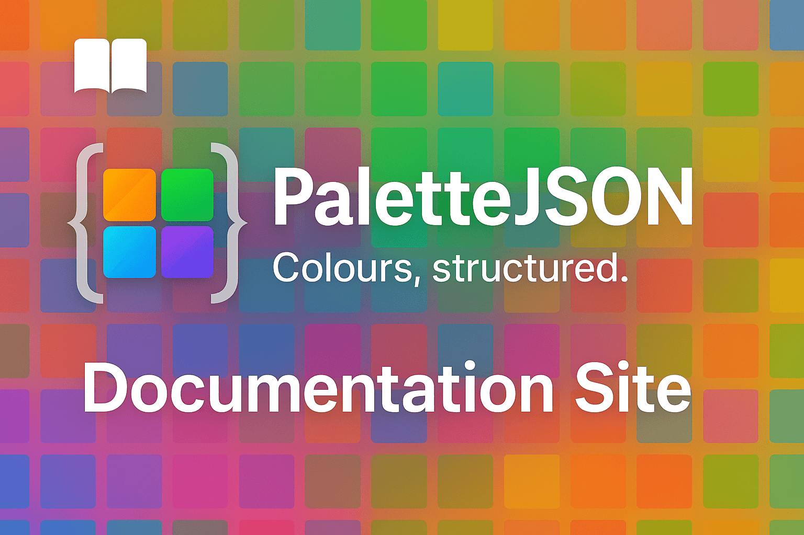

# PaletteJSON Documentation

This repository hosts the documentation for [PaletteJSON](https://palettejson.org), a portable JSON container format for color palettes.

## About PaletteJSON

PaletteJSON is a specification for sharing and storing color palettes in a structured, interoperable way.  
It aims to be a bridge format — a lingua franca for color — that can work across tools, languages, and design systems.

For the specification itself, see the [palettejson-schema repository](https://github.com/palettejson/palettejson-schema).

## Contributing

We welcome contributions to the documentation.  
Ways you can help include:

- Fixing typos and broken links.
- Improving explanations and examples.
- Helping with consistency and structure across documentation pages.

Please see our [CONTRIBUTING.md](CONTRIBUTING.md) for details, and note our [Code of Conduct](CODE_OF_CONDUCT.md).

## License

Documentation is licensed under the [Apache License, Version 2.0](LICENSE).
